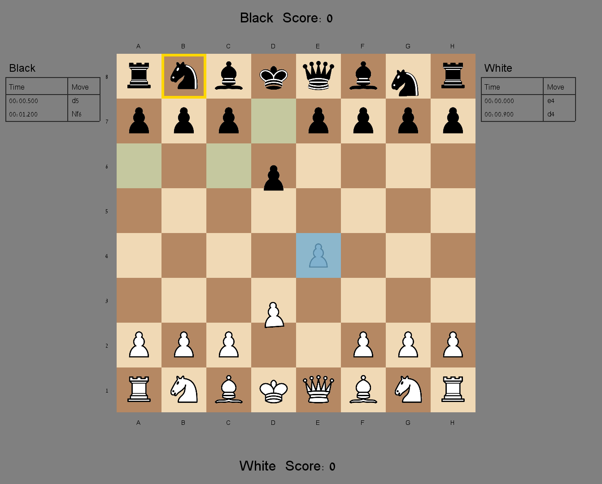

# Kung Fu Chess

**Kung Fu Chess** is a real-time twist on chess: there are no turns. Both
players move whenever they want, and every move takes real time to travel
across the board instead of resolving instantly. That single change turns
the classic game into something much closer to an action game - you can
sacrifice a piece to buy tempo, race an opponent's slower piece to a square,
or **jump** a piece in place to dodge an incoming capture at the last
second, all while the clock keeps running for both sides at once.

The project is a full desktop implementation in Java: a real-time game
engine, standard chess movement rules, a live game clock, capture scoring,
a move-history panel, and an interactive graphical board built on Java
Swing.



*The live game window: board, per-side move history with timestamps,
capture score, and the yellow/green highlights showing the selected piece
and its currently-legal destinations.*

## What makes it "Kung Fu" chess

- **No turns, no waiting.** Either side can issue a move at any moment;
  legality is judged purely by the current board state and the virtual
  clock, not by whose "turn" it is.
- **Moves take time.** A queen sliding five squares is on the board mid-move
  for a while - during that window the piece isn't at its origin *or* its
  destination, and other moves can be requested that interact with it.
- **Jump to dodge.** Right-clicking a piece makes it jump in place for a
  short, fixed duration. If an enemy piece is already sliding toward that
  square, the jump either finishes in time (the attacker's move harmlessly
  passes through) or finishes too late (the piece is captured) - a genuine
  real-time race, not a scripted animation.
- **Races and collisions resolve like physical events.** Two pieces sliding
  into a head-on swap, two same-color pieces converging on the same square,
  a knight racing another knight to a landing square - each of these is
  settled deterministically by arrival time, not by move order.
- **Live scoreboard and move log.** Captured material is tallied per side in
  real time, and every accepted move is timestamped and listed in
  algebraic-style notation as it happens.

## Playing it

The graphical version opens an interactive window: left-click a piece to
select it (its legal destinations light up), left-click a highlighted
square to send it there, or right-click any of your own pieces to make it
jump in place. There are no turns to wait through - both sides can act at
any time, and the board keeps animating continuously.

```bash
cd src
javac -encoding UTF-8 -d ../out @sources.txt
cd ..
java -cp out GuiMain < resources/demo_board_8x8.txt
```

A separate, console-only entry point (`Main`) exists for scripted/headless
play: it reads a board and a fixed list of commands (`click`, `jump`,
`wait`, `print board`) from stdin and prints the board to stdout after each
command, which is what the automated tests and grading tools drive.

```bash
java -cp out Main < input.txt
```

## Package structure

```
src/
├── model/        ← pure data (no game logic)
│   ├── Position.java      immutable (row,col) + distance helpers
│   ├── Piece.java         color + type, promotedAt() (no token knowledge)
│   ├── Board.java         the grid + safe cell accessors
│   ├── MovingPiece.java   a piece in transit (from→to, timing)
│   └── GameState.java     virtual clock + game-over flag
│
├── parsing/      ← turn raw text into a Board (owns the "wK" token format)
│   ├── BoardParser.java   text → String[][] (+ row-width check)
│   ├── BoardValidator.java validates tokens
│   ├── PieceMapper.java   token ↔ Piece (parse / format), the only token codec
│   └── BoardMapper.java   orchestrates parse → validate → map to Board
│
├── ruleengine/   ← "is this move allowed?" (never mutates anything)
│   ├── PieceRules.java     one switch-case: geometry per piece type
│   └── MoveValidator.java  general checks for ANY piece (source non-empty, not
│                           friendly-occupied, path clear) — no piece type, no config
│
├── gameengine/   ← the game itself
│   ├── GameEngine.java     central gateway: validates, schedules, decides game-over
│   └── RealTimeArbiter.java owns pieces-in-transit, jump/dodge races, head-on
│                           collisions, capture scoring and the virtual clock
│
├── event/        ← the input side
│   ├── EventEngine.java    click semantics (select / cancel / re-select / move request)
│   ├── EventMapper.java    command string → GameEvent
│   ├── InputMapper.java    pixel coords → cell coords
│   ├── EventDispatcher.java routes events to the EventEngine
│   ├── GameEvent.java + *EventImpl.java  one event type per command
│   └── ClickEvent.java / CellClickEvent.java  input data holders
│
├── snapshot/     ← render-ready, immutable description of "the board right now"
│   ├── GameSnapshot.java    pieces, scores, move history, selection, legal moves
│   ├── PieceSnapshot.java / PieceVisualState.java  per-piece animation state
│   ├── SnapshotBuilder.java builds a snapshot from the live model
│   └── MoveNotation.java    algebraic-style move text for the history panel
│
├── view/
│   ├── BoardRenderer.java  text rendering (stdout), incl. in-transit pieces
│   ├── ImgRenderer.java    graphical rendering onto the dashboard image
│   ├── BoardWindow.java    the interactive Swing window (mouse + animation timer)
│   ├── PieceSprites.java   picks the right sprite frame per piece/animation state
│   └── Img.java / BoardGeometry.java  small image + pixel/cell math helpers
│
├── controller/
│   └── BoardController.java wires the whole chain, exposes executeCommand()
│
├── config/
│   └── GameConfig.java     all constants (durations, cell size, token patterns)
│
├── Main.java               console entry point: reads stdin, drives BoardController
└── GuiMain.java            graphical entry point: opens the interactive BoardWindow
```

## How a command flows

```
stdin ─▶ BoardController ─▶ EventDispatcher ─▶ EventEngine ─▶ GameEngine
                                                                 │
                                        RuleEngine (MoveValidator + PieceRules)
                                                                 │
                                                          RealTimeArbiter ─▶ Board
                                                                 │
                                              BoardRenderer / ImgRenderer ─▶ output
```

- **EventEngine** interprets clicks and jumps and produces a ready move/jump
  request.
- **GameEngine** is the single gateway: it asks the **RuleEngine** whether the
  move is allowed, computes its duration, and hands scheduling to the
  **RealTimeArbiter**.
- **RealTimeArbiter** owns everything about time: it holds the active moves,
  advances the virtual clock, resolves jumps, collisions and races, and
  applies board changes atomically on arrival. Tests never sleep - they push
  virtual time forward directly.

## Movement rules — one class, one switch

Every piece's movement geometry lives in a single class,
**`ruleengine.PieceRules`**, as a `switch` over `Piece.Type`. A piece is just
data (`Piece` holds its type); the rules are centralized in one place, so
**adding a new piece means adding one `case`** - no new class per piece.

```java
switch (type) {
    case K: return rowDist <= 1 && colDist <= 1;
    case R: return (rowDist == 0 || colDist == 0) && pathClear(...);
    case B: return (rowDist == colDist)           && pathClear(...);
    case Q: return (rowDist == 0 || colDist == 0 || rowDist == colDist) && pathClear(...);
    case N: return (rowDist == 1 && colDist == 2) || (rowDist == 2 && colDist == 1);
    case P: return isValidPawn(...);
}
```

## Tests & coverage

Unit tests (JUnit 5) live in `src/tests/` and cover every layer, from token
parsing to the real-time collision/jump races in `RealTimeArbiter`. To
compile, run them, and generate a JaCoCo HTML coverage report in one step:

```powershell
powershell -File tools/run-tests.ps1
```

This has no Maven/Gradle dependency - it downloads the JUnit console
launcher and JaCoCo jars into `tools/` on first run (not committed to git),
then opens the report at `out/coverage-html/index.html`.

## Console input format

For the headless entry point (`Main`), a board plus a fixed command list is
read from stdin:

```
Board:
wK bK . .
. . . .
Commands:
click 0 0
wait 500
print board
```

Commands: `click x y`, `jump x y` (pixel coordinates), `wait ms`, `print board`.
