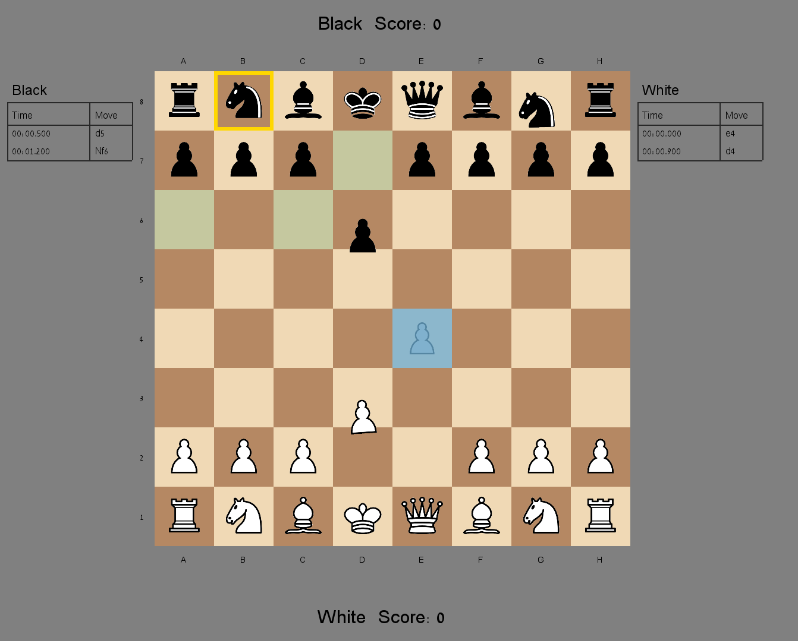

# Kung Fu Chess

**Kung Fu Chess** is chess with the turns ripped out. Both players can move
*whenever they want*, every move takes real time to travel across the board
instead of resolving instantly, and a piece can **jump** in place to dodge an
incoming capture in a genuine, millisecond-timed race. The result feels less
like a board game and more like an action game: you can sacrifice a piece to
buy tempo, race an opponent's slower piece to a contested square, or gamble
on a jump landing a heartbeat before the attacker arrives.

This repository is a complete implementation of that idea, built from the
ground up in Java: a deterministic real-time game engine, full chess movement
rules, a live game clock, capture scoring, an interactive Swing GUI - and,
layered on top, a genuinely scalable multiplayer server with accounts, ELO
rating, matchmaking, rooms, spectators, reconnect handling, and a
Docker-Compose-deployable microservice architecture behind it.



*The live game window: board, per-side move history with timestamps, capture
score, and the yellow/green highlights showing the selected piece and its
currently-legal destinations.*

## Contents

- [What makes it "Kung Fu" chess](#what-makes-it-kung-fu-chess)
- [Quick start: play it locally](#quick-start-play-it-locally)
- [Headless / scripted play](#headless--scripted-play)
- [Playing it online](#playing-it-online)
- [Scaling up: the distributed server](#scaling-up-the-distributed-server)
- [Repository layout](#repository-layout)
- [Architecture](#architecture)
- [How a command flows](#how-a-command-flows)
- [Movement rules: one class, one switch](#movement-rules-one-class-one-switch)
- [Tests & coverage](#tests--coverage)
- [Console input format](#console-input-format)
- [Further reading](#further-reading)

## What makes it "Kung Fu" chess

- **No turns, no waiting.** Either side can issue a move at any moment;
  legality is judged purely by the current board state and the virtual
  clock, never by whose "turn" it is.
- **Moves take time.** A queen sliding five squares is genuinely mid-flight
  for a while - during that window it isn't at its origin *or* its
  destination, and other moves can be requested that interact with it.
- **Jump to dodge.** Right-clicking a piece makes it jump in place for a
  short, fixed duration. If an enemy piece is already sliding toward that
  square, the jump either finishes in time (the attacker's move harmlessly
  passes through) or finishes just late enough to be captured on landing -
  a genuine real-time race, resolved by arrival time, not a scripted
  animation.
- **Races and collisions resolve like physical events.** Two pieces sliding
  into a head-on swap, two same-color pieces converging on the same square,
  a knight racing another knight to a landing square - each is settled
  deterministically, tick by tick, by who actually gets there first.
- **Live scoreboard and move log.** Captured material is tallied per side in
  real time, and every accepted move is timestamped and listed in
  algebraic-style notation as it happens.
- **Ranked online multiplayer.** Accounts, ELO-based quick-match, shareable
  room codes, unlimited spectators, disconnect/reconnect handling, and
  one-click rematches - all riding on top of the exact same engine used for
  offline play.
- **Built to scale.** The same server can run as one embedded process for a
  quick local game, or as nine cooperating containers (API Gateway, WS
  Gateway, Matchmaker, Game Allocator, multiple Game Server Shards, Redis,
  NATS, PostgreSQL) behind Docker Compose - see
  [Scaling up](#scaling-up-the-distributed-server).

## Quick start: play it locally

```bash
powershell -File tools/fetch-libs.ps1   # downloads lib/*.jar once (see "Repository layout")

cd src/main
javac -encoding UTF-8 -cp "../../lib/Java-WebSocket-1.5.6.jar;../../lib/slf4j-api-2.0.13.jar;../../lib/sqlite-jdbc-3.46.1.3.jar;../../lib/postgresql-42.7.4.jar;../../lib/jedis-5.1.3.jar;../../lib/commons-pool2-2.12.0.jar;../../lib/jnats-2.17.2.jar" -d ../../out @sources.txt
cd ../..

java -cp out GuiMain < resources/demo_board_8x8.txt
```

This opens an interactive window: left-click a piece to select it (its legal
destinations light up), left-click a highlighted square to send it there, or
right-click any of your own pieces to make it jump in place. Both sides can
act at any time - there's no turn to wait through, and the board keeps
animating continuously.

## Headless / scripted play

A separate console entry point (`Main`) exists for scripted or automated
play: it reads a board plus a fixed list of commands from stdin and prints
the board to stdout after each one - this is exactly what the automated
tests and grading tools drive.

```bash
java -cp out Main < input.txt
```

See [Console input format](#console-input-format) for the exact syntax.

## Playing it online

`NetworkGuiMain` opens the *exact same* interactive window as `GuiMain`, but
against a real server instead of a local, in-process engine - every
connected side sees the others' moves live. Before the board ever opens:

1. **Sign in.** A small alert (server address, username, password,
   Login/Register). Registering creates a new account (starting rating
   **1200**); logging in checks the password against it.
2. **Pick a game.**
   - **Quick Play** pairs you automatically with any other waiting player
     rated within ±100 ELO of you - if no one suitable is waiting yet, you
     just wait, up to 60 seconds.
   - **Room** lets you **Create** a short shareable code (shown in the
     window's title bar) or **Join** an existing one. Inside a room, the
     first two people to join play White and Black; anyone after that joins
     as a read-only **spectator** - unlimited spectators are supported.
3. A quick on-screen 3-2-1, then the board.

A few things make this feel like a real live service rather than a toy demo:

- **Disconnect handling.** If a seated player's connection drops, the game
  **pauses immediately** - the clock freezes and the still-connected side
  can't act, so nobody gets a free window against an opponent who can't
  respond - and a visible countdown appears. Reconnect in time and play
  resumes exactly where it left off, seat and all. Miss the window (20
  seconds by default) and the game ends with **no winner and no rating
  change**, since a dropped connection is nobody's fault.
- **Rematch.** Once a game is over, either player can press **R** to start
  a fresh game on a clean board, in the same room, with the same opponent.
- **Ranked ratings.** Every game that ends with a real winner (king capture
  or resignation) triggers a standard ELO update, persisted to the account
  database.
- **Activity logging.** Both the server and each client append a
  plain-text, append-only activity log (`logs/server.log`,
  `logs/client-<username>.log`).

The simplest way to run it - one process, in-memory/SQLite state, no
external services required:

```bash
# terminal 1 - the server (WebSocket on 8887, REST API on 8888)
java -cp "out;lib/Java-WebSocket-1.5.6.jar;lib/slf4j-api-2.0.13.jar;lib/sqlite-jdbc-3.46.1.3.jar;lib/postgresql-42.7.4.jar;lib/jedis-5.1.3.jar;lib/commons-pool2-2.12.0.jar;lib/jnats-2.17.2.jar" server.main.KungFuChessServerMain

# one terminal per participant; each opens the sign-in alert first
java -cp "out;lib/Java-WebSocket-1.5.6.jar;lib/slf4j-api-2.0.13.jar;lib/sqlite-jdbc-3.46.1.3.jar;lib/postgresql-42.7.4.jar;lib/jedis-5.1.3.jar;lib/commons-pool2-2.12.0.jar;lib/jnats-2.17.2.jar" NetworkGuiMain
```

## Scaling up: the distributed server

The networked server isn't just a single WebSocket process bolted onto the
game engine - it's built to grow into a proper horizontally-scaled
architecture, and that architecture is fully implemented today, not just
sketched out. One command spins up the whole thing:

```bash
docker compose up --build
```

That builds **nine cooperating containers**, each a genuinely separate
process talking to the others only over the network, never via a shared
Java reference:

| Service | Role |
|---|---|
| `api-gateway` | REST endpoints: `POST /api/login`, `/api/register`, `/api/rooms` |
| `ws-gateway` | Accepts WebSocket connections, authenticates, routes every command to the right shard |
| `matchmaker` | Owns the ELO-ranged (±100) quick-match queue |
| `game-allocator` | Decides which shard a brand-new room should run on (load-aware, picks the least-busy shard) |
| `game-server-shard-1` / `-2` | Each runs its own `Lobby` and every `GameSession` it owns - the actual `GameEngine` instances live here |
| `postgres` | Accounts, ratings, finished games and their full move history |
| `redis` | Session tokens, reconnect lookups, room→shard routing, the matchmaking queue |
| `nats` | The internal message bus every process uses to talk to every other one |

A few things worth knowing about how it fits together:

- **Nothing about the game engine changes.** A Game Server Shard runs the
  exact same `GameEngine`/`RealTimeArbiter` that offline, single-process
  play uses. Scaling out is purely about *where connections and rooms are
  routed*, never about the rules or the timing model.
- **The same code runs both ways.** Every one of these pieces also runs
  embedded, in-process, with in-memory/SQLite state, whenever
  `KFC_REDIS_URL`/`KFC_NATS_URL` aren't set - which is exactly what the
  single-process command in [Playing it online](#playing-it-online) above
  is doing. Nothing here is a separate code path bolted on for Docker; it's
  the same classes picking a different implementation (`RedisXxx` vs.
  `InMemoryXxx`, `NatsBus` vs. `InMemoryBus`) based on which environment
  variables are set.
- **Routing is dynamic.** `join_room <code>` is resolved fresh every time
  via a Redis-backed `RoomDirectory` (never cached, so a stale shard from a
  previous game can never leak into a new one); once a connection is
  attached to a shard, every later command for it is routed straight there.
- **Every process is split three ways**, consistently: a `Main` (own
  `main`, wires everything, no logic), a `Controller` (the process's actual
  endpoints - NATS subscriptions, WebSocket callbacks, HTTP routes), and a
  `Service` (the real decision logic). See [Architecture](#architecture)
  below.

This is genuinely staged, incremental work, not a finished claim of
production-readiness - `Server_Design.md` tracks exactly which steps of the
reference design are done and which (observability, Kubernetes manifests)
are deliberately not yet.

## Repository layout

| Path | What it is | Tracked in Git? |
|---|---|---|
| `src/main/` | All production Java source; `sources.txt` is the authoritative `javac` file list | Yes |
| `src/tests/` | JUnit 5 tests (flat, package `tests`), compiled and run separately from `src/main/` | Yes |
| `resources/` | Runtime image/text assets (`board.png`, `dashboard.png`, per-piece sprite sheets, the demo board fixture) - loaded via relative paths at runtime, so kept as a sibling of `src/` rather than inside it, and `java` must be run from the repo root for those paths to resolve | Yes |
| `docs/` | In-depth design write-ups (overview, game-engine internals, networking internals) | Yes |
| `Server_Design.md` | Live roadmap tracking this project against the scalable-server reference design | Yes |
| `lib/` | Runtime dependency jars (Java-WebSocket, SQLite/PostgreSQL JDBC drivers, Jedis, JNats) | No - fetched on demand by `tools/fetch-libs.ps1` |
| `tools/` | `fetch-libs.ps1`, `run-tests.ps1`, plus the JUnit/JaCoCo jars they download on first use | Scripts yes, jars no |
| `out/` | Compiled `.class` output (from `javac` and from `tools/run-tests.ps1`) and the JaCoCo coverage report | No - pure build output, regenerated on every build |
| `data/` | The server's SQLite account database (`kungfuchess.db`), created on first run | No |
| `logs/` | Append-only server/client activity logs, created on first run | No |
| `Dockerfile`, `docker-compose.yml`, `.dockerignore` | The nine-container distributed deployment described above | Yes |

## Architecture

Strict layering, one responsibility per class:

```
src/
├── main/         ← all production code; src/main/sources.txt is the authoritative
│   │               javac file list (compile from inside src/main/, see "Quick start")
│   │
│   ├── model/        ← pure data, no logic
│   │   ├── Position.java, Piece.java, Board.java, MovingPiece.java,
│   │   │   RestingPiece.java, MoveLogEntry.java, GameState.java
│   │
│   ├── parsing/      ← turns raw text into a Board (owns the "wK" token format)
│   │   └── BoardParser.java, BoardValidator.java, PieceMapper.java, BoardMapper.java
│   │
│   ├── ruleengine/   ← "is this move allowed?" - never mutates anything
│   │   └── PieceRules.java (geometry, one switch per piece type),
│   │       MoveValidator.java (occupancy/path checks), RuleEngine.java
│   │
│   ├── gameengine/   ← the real engine
│   │   ├── GameEngine.java      single gateway: validate → schedule → decide game-over
│   │   └── RealTimeArbiter.java owns every in-flight move, jump/dodge races, head-on
│   │                            collisions, capture scoring, and the virtual clock
│   │
│   ├── event/        ← the input side
│   │   ├── EventEngine.java, ClickSelector.java, GameClient.java,
│   │   │   EventMapper.java, InputMapper.java, EventDispatcher.java, GameEvent.java + impls
│   │
│   ├── snapshot/     ← immutable, render-ready "the board right now"
│   │   └── GameSnapshot.java, PieceSnapshot.java, PieceVisualState.java,
│   │       SnapshotBuilder.java, MoveNotation.java
│   │
│   ├── view/         ← rendering + the interactive Swing window
│   │   └── BoardRenderer.java, ImgRenderer.java, BoardWindow.java,
│   │       PieceSprites.java, Img.java, BoardGeometry.java
│   │
│   ├── controller/
│   │   └── BoardController.java  wires the whole local chain, exposes executeCommand()
│   │
│   ├── config/
│   │   └── GameConfig.java       every constant (durations, cell size, token patterns)
│   │
│   ├── bus/          ← generic publish/subscribe, in-process or cross-process
│   │   └── Bus.java, InMemoryBus.java, NatsBus.java
│   │
│   ├── client/       ← code that only ever runs on the client
│   │   └── NetworkGameClient.java, LoginDialog.java, LobbyDialog.java
│   │
│   ├── logging/
│   │   └── ActivityLog.java      append-only timestamped text logs
│   │
│   ├── server/       ← the networked, horizontally-scalable game server
│   │   ├── main/         one Main per process (own main(), wiring only)
│   │   │   └── KungFuChessServerMain, GameServerShardMain, MatchmakerMain,
│   │   │       GameAllocatorMain, ApiGatewayMain
│   │   ├── controller/   each process's endpoints only (WS/HTTP/NATS in, nothing else)
│   │   │   └── KungFuChessServerController, GameServerShardController,
│   │   │       MatchmakerController, GameAllocatorController, HttpApiServer
│   │   ├── service/      the decision logic behind each controller
│   │   │   └── KungFuChessServerService, GameServerShardService,
│   │   │       MatchmakerService, GameAllocatorService, ApiGateway
│   │   ├── connection/   OutboundConnection abstraction (local socket vs. NATS relay)
│   │   │   └── OutboundConnection, LocalOutboundConnection, RemoteOutboundConnection
│   │   ├── room/         room creation + roomCode→shard directory, in-process or Redis
│   │   │   └── RoomCreator, LocalRoomCreator, RemoteRoomCreator, RoomDirectory,
│   │   │       InMemoryRoomDirectory, RedisRoomDirectory, RoomCreationException
│   │   ├── reconnect/    username→roomCode lookup, in-process or Redis
│   │   │   └── ReconnectRegistry, InMemoryReconnectRegistry, RedisReconnectRegistry
│   │   ├── auth/         accounts, passwords, ELO ratings, persisted game history
│   │   │   └── UserRepository, PasswordHasher, AuthService, AuthCommandParser,
│   │   │       EloCalculator, RatingService, GameResultRepository,
│   │   │       SessionTokenStore, InMemorySessionTokenStore, RedisSessionTokenStore
│   │   └── Lobby.java, GameSession.java, MatchQueue.java, ShardPicker.java,
│   │       Protocol.java, Seat.java, SnapshotCodec.java, GatewayCommandEnvelope.java,
│   │       SeatPairEnvelope.java, GameAllocatorClient.java,
│   │       MatchmakingQueueStore.java (+ InMemory/Redis)
│   │
│   ├── Main.java               console entry point: reads stdin, drives BoardController
│   ├── GuiMain.java            graphical entry point: opens BoardWindow, offline
│   ├── NetworkGuiMain.java     graphical entry point: opens BoardWindow, over the network
│   └── sources.txt             the javac file list (excludes src/tests/)
│
└── tests/        ← JUnit 5 tests, flat (no subpackage) - see "Tests & coverage"
```

## How a command flows

Offline/local play - the same chain a networked `GameSession` drives once
per side:

```
stdin ─▶ BoardController ─▶ EventDispatcher ─▶ EventEngine ─▶ GameEngine
                                                                 │
                                        RuleEngine (MoveValidator + PieceRules)
                                                                 │
                                                          RealTimeArbiter ─▶ Board
                                                                 │
                                              BoardRenderer / ImgRenderer ─▶ output
```

- **EventEngine** interprets clicks and jumps and produces a ready move/jump
  request.
- **GameEngine** is the single gateway: it asks the **RuleEngine** whether
  the move is allowed, computes its duration, and hands scheduling to the
  **RealTimeArbiter**.
- **RealTimeArbiter** owns everything about time: it holds the active
  moves, advances the virtual clock, resolves jumps, collisions and races,
  and applies board changes atomically on arrival. Tests never sleep - they
  push virtual time forward directly, which is what makes the real-time
  logic deterministically testable.

## Movement rules: one class, one switch

Every piece's movement geometry lives in a single class,
**`ruleengine.PieceRules`**, as a `switch` over `Piece.Type`. A piece is just
data (`Piece` holds its type); the rules are centralized in one place, so
**adding a new piece means adding one `case`** - no new class per piece.

```java
switch (type) {
    case K: return rowDist <= 1 && colDist <= 1;
    case R: return (rowDist == 0 || colDist == 0) && pathClear(...);
    case B: return (rowDist == colDist)           && pathClear(...);
    case Q: return (rowDist == 0 || colDist == 0 || rowDist == colDist) && pathClear(...);
    case N: return (rowDist == 1 && colDist == 2) || (rowDist == 2 && colDist == 1);
    case P: return isValidPawn(...);
}
```

## Tests & coverage

Unit tests (JUnit 5) live in `src/tests/` and cover every layer, from token
parsing to the real-time collision/jump races in `RealTimeArbiter`. To
compile, run them, and generate a JaCoCo HTML coverage report in one step:

```powershell
powershell -File tools/run-tests.ps1
```

This has no Maven/Gradle dependency - it downloads the JUnit console
launcher and JaCoCo jars into `tools/` on first run (not committed to git),
then opens the report at `out/coverage-html/index.html`.

To run a single test class directly once those jars exist:

```powershell
java -cp "out/classes;out/test-classes;tools/junit-console.jar" org.junit.platform.console.ConsoleLauncher --select-class=tests.RealTimeArbiterTest --details=tree
```

## Console input format

For the headless entry point (`Main`), a board plus a fixed command list is
read from stdin:

```
Board:
wK bK . .
. . . .
Commands:
click 0 0
wait 500
print board
```

Commands: `click x y`, `jump x y` (pixel coordinates), `wait ms`,
`print board`.

## Further reading

- [`CLAUDE.md`](CLAUDE.md) - the full, class-by-class architecture
  reference (also what guides AI-assisted work on this repo).
- [`Server_Design.md`](Server_Design.md) - the live roadmap tracking this
  project's server against the scalable-server reference design: what's
  done, what's deliberately deferred, and why each step was scoped the way
  it was.
- [`docs/01_overview.md`](docs/01_overview.md),
  [`docs/02_game_engine_deep_dive.md`](docs/02_game_engine_deep_dive.md),
  [`docs/03_networking_deep_dive.md`](docs/03_networking_deep_dive.md)
  (Hebrew) - narrative deep dives into the project's history, the real-time
  engine internals, and the networking layer, respectively.
